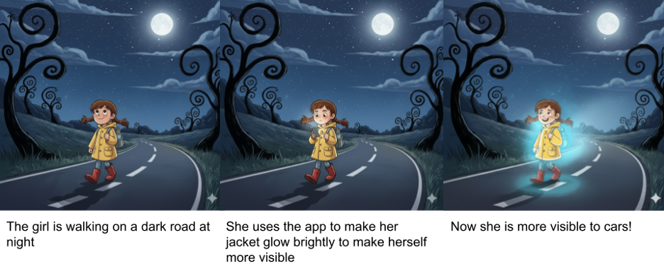
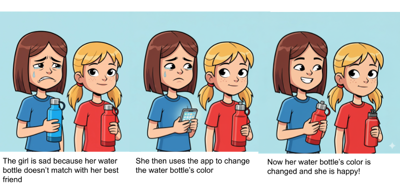
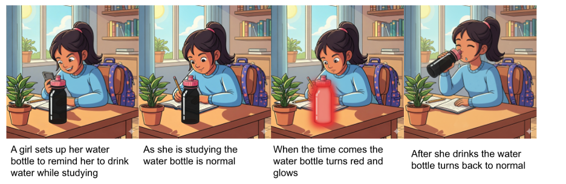
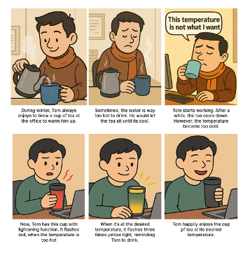
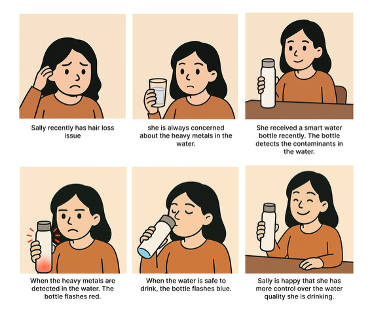
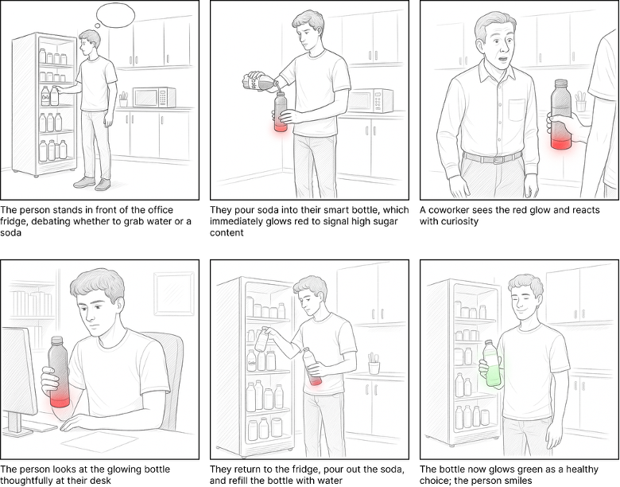
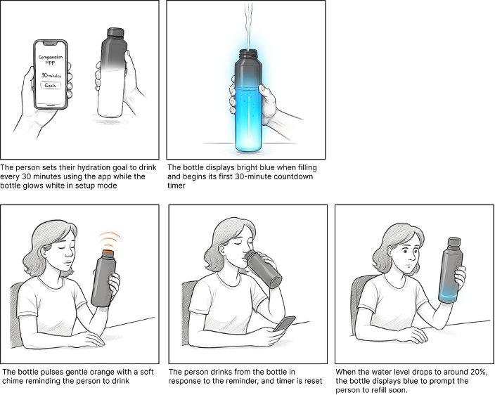
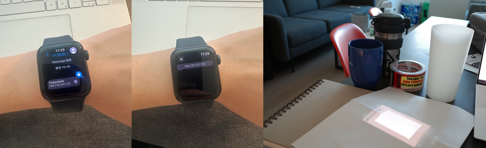
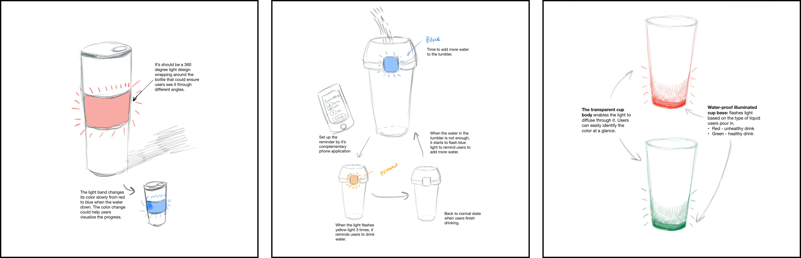

# Staging Interaction

\*\***COLLABORATORs: Amy Chen, Jully (Hujiaojiao) Li, Sirui Wang**\*\*

In the original stage production of Peter Pan, Tinker Bell was represented by a darting light created by a small handheld mirror off-stage, reflecting a little circle of light from a powerful lamp. Tinkerbell communicates her presence through this light to the other characters. See more info [here](https://en.wikipedia.org/wiki/Tinker_Bell). 

There is no actor that plays Tinkerbell--her existence in the play comes from the interactions that the other characters have with her.

For lab this week, we draw on this and other inspirations from theatre to stage interactions with a device where the main mode of display/output for the interactive device you are designing is lighting. You will plot the interaction with a storyboard, and use your computer and a smartphone to experiment with what the interactions will look and feel like. 

_Make sure you read all the instructions and understand the whole of the laboratory activity before starting!_

## Prep

### To start the semester, you will need:
1. Read about Git [here](https://git-scm.com/book/en/v2/Getting-Started-What-is-Git%3F).
2. Set up your own Github "Lab Hub" repository by forking the [Interactive-Lab-Hub repository](https://github.com/FAR-Lab/Interactive-Lab-Hub). To get lab updates, simply [use GitHub's "Sync fork" button when new content is available](https://docs.github.com/en/pull-requests/collaborating-with-pull-requests/working-with-forks/syncing-a-fork).

3. Set up the README.md for your Hub repository (for instance, so that it has your name and points to your own Lab 1). You can [learn how to organize and format your README.md here](https://docs.github.com/en/get-started/writing-on-github/getting-started-with-writing-and-formatting-on-github/basic-writing-and-formatting-syntax). Make sure to include links to your submissions so they are easy to find.

### For this lab, you will need:
1. Paper
2. Markers/ Pens
3. Scissors
4. Smart Phone -- The main required feature is that the phone needs to have a browser and display a webpage.
5. Computer -- We will use your computer to host a webpage which also features controls.
6. Found objects and materials -- You will have to costume your phone so that it looks like some other devices. These materials can include doll clothes, a paper lantern, a bottle, human clothes, a pillow case, etc. Be creative!

### Deliverables for this lab are: 
1. 7 Storyboards
1. 3 Sketches/photos of costumed devices
1. Any reflections you have on the process
1. Video sketch of 3 prototyped interactions
1. Submit the items above in the lab1 folder of your class [Github page], either as links or uploaded files. Each group member should post their own copy of the work to their own Lab Hub, even if some of the work is the same from each person in the group.

### The Report
This README.md page in your own repository should be edited to include the work you have done (the deliverables mentioned above). Following the format below, you can delete everything but the headers and the sections between the **stars**. Write the answers to the questions under the starred sentences. Include any material that explains what you did in this lab hub folder, and link it in your README.md for the lab.

## Lab Overview
For this assignment, you are going to:

A) [Plan](#part-a-plan) 

B) [Act out the interaction](#part-b-act-out-the-interaction) 

C) [Prototype the device](#part-c-prototype-the-device)

D) [Wizard the device](#part-d-wizard-the-device) 

E) [Costume the device](#part-e-costume-the-device)

F) [Record the interaction](#part-f-record)

Labs are due on Mondays. Make sure this page is linked to on your main class hub page.

## Part A. Plan 

To stage an interaction with your interactive device, think about:

_Setting:_ Where is this interaction happening? (e.g., a jungle, the kitchen) When is it happening?

_Players:_ Who is involved in the interaction? Who else is there? If you reflect on the design of current day interactive devices like the Amazon Alexa, it’s clear they didn’t take into account people who had roommates, or the presence of children. Think through all the people who are in the setting.

_Activity:_ What is happening between the actors?

_Goals:_ What are the goals of each player? (e.g., jumping to a tree, opening the fridge). 

The interactive device can be anything *except* a computer, a tablet computer or a smart phone, but the main way it interacts needs to be using light.

\*\***Describe your setting, players, activity and goals here.**\*\*

Storyboards are a tool for visually exploring a users interaction with a device. They are a fast and cheap method to understand user flow, and iterate on a design before attempting to build on it. Take some time to read through this explanation of [storyboarding in UX design](https://www.smashingmagazine.com/2017/10/storyboarding-ux-design/). Sketch seven storyboards of the interactions you are planning. **It does not need to be perfect**, but must get across the behavior of the interactive device and the other characters in the scene. 

\*\***Include pictures of your storyboards here**\*\*

Present your ideas to the other people in your breakout room (or in small groups). You can just get feedback from one another or you can work together on the other parts of the lab.

### Scenario 1: Illuminated clothing

_(Images generated by Gemini 2.5 flash)_

**Setting:** The primary setting would be outdoors at night for the greatest effect. That being said the clothes should also function in different light and weather conditions where they could be worn. 

**Players:** The primary player would be the user wearing the light up clothes, with secondary players being the people around them who can see the clothes. 

**Activity:** 
1) The user finds herself in a low light environment.
2) The user then uses the app to make her jacket glow, choosing the light blue color. 
3) The user’s jacket then begins to glow. 

**Goals:** 
- <ins>Primary User ’s Goal</ins>: Make themselves more noticeable in a low-light environment.
- <ins>Surrounding Individuals’ Goal</ins>: To safely navigate the low-light environment and notice the primary user in order to safely avoid them. 

### Scenario 2: Alter bottle color

_(Images generated by Gemini 2.5 flash)_

**Setting:** The setting would be anywhere, indoor or outdoor, users take their bottles. Common settings could be: offices, sports practices, and classrooms. 

**Players:** The primary player would be the owner of the water bottle with secondary players being those around the user. It’s important to make sure that these secondary players are not bothered by the water bottle. 

**Activity:** 
1) The user notices her friend’s water bottle and wants to match. 
2) The user then uses the app to make her water bottle change colors. 
3) The user’s water bottle now matches her friend’s water bottle. 

**Goals:** 
- <ins>Primary User ’s Goal</ins>: Stay on trend and have matching water bottles with their friends. 
- <ins>Surrounding Individuals’ Goal</ins>: Remain undisturbed by the water bottle. 

### Scenario 3: The water bottle flashes to remind the users to drink water

_(Images generated by Gemini 2.5 flash)_

**Setting:** The setting would be anywhere, indoor or outdoor, users take their bottles. Common settings could be: offices, classrooms, and libraries. 

**Players:** The primary player would be the owner of the water bottle with secondary players being those around the user. It’s important to make sure that these secondary players are not bothered by the water bottle flashing. 

**Activity:** 
1) The user sets up a schedule to remind her to drink water.
2) While the user is studying the water bottle stays normal and out of the way. 
3) When the time comes, the water bottle glows red, getting the user’s attention. 
4) As the user drinks, her water bottle returns its normal state. 

**Goals:** 
- <ins>Primary User ’s Goal</ins>: Get reminders to stay hydrated during long, focused periods of time. 
- <ins>Surrounding Individuals’ Goal</ins>: Remain undisturbed by the water bottle.

### Scenario 4: Detect water temperature

_(Images are generated by ChatGPT-5)_

**Setting:** The kitchen could be the main setting, where users complete the initial action of pouring water into the tea cup. Subsequent drinking behaviors could then take place in any setting where users carry the bottle. The interaction takes place when users monitor the water temperature to ensure it is within their desired range.

**Players:** The primary user is an individual seeking to brew tea at their preferred temperature. Given the portability of the tea cup and its potential use in diverse environments, such as offices setting in the storyboard, it is important to consider contextual factors in which nearby individuals may be affected by the device’s flashing indicator. In the storyboard, these individuals could be coworkers.

**Activity:** 
1) The primary user pours boiling water into his tea cup.
2) The tea cup flashes red to indicate the water is too hot to drink.
3) Set the tea cup aside.
4) The tea cup flashes yellow three times when the tea reaches the perfect temperature.
5) The user drinks his tea at the right warmth.

**Goals:** 
- <ins>Primary User ’s Goal</ins>: Enjoy a perfectly warm cup of tea without constant guessing or burning their mouth.
- <ins>Surrounding Individuals’ Goal</ins>: To remain undisturbed by the interaction; the bottle’s design uses silent, light-based indicators that are clear for the user yet non-intrusive for others.

### Scenario 5: Detect water contaminants

_(Images are generated by ChatGPT-5)_

**Setting:** The primary setting is the kitchen, where the user first fills the smart water bottle with tap water. The interaction continues as she moves between locations, such as their dining area or living room, while drinking throughout the day. The key interaction moments happen when the bottle’s flashing lights communicate the safety of the water.

**Players:** Primary player is an individual actively seeking control over the quality of her drinking water. Surrounding individuals could be the secondary players in the settings, such as housemates, family members, or guests may see the bottle’s flashing indicators. This creates a need for clear, universally understood signals without being overly disruptive.

**Activity:** 
1) The user fills the smart water bottle with tap water.
2) The bottle flashes red to indicate high levels of heavy metals or other contaminants.
3) The user pauses and considers alternatives (e.g., using a filter, boiled or bottled water).
4) After replacing the water with a safe source, the bottle flashes blue to indicate it’s safe to drink.
5) The user drinks confidently, reassured about the water quality.

**Goals:** 
- <ins>Primary User ’s Goal</ins>: Gain peace of mind and control over water quality, reducing anxiety around contaminants potentially linked to their health concerns.
- <ins>Surrounding Individuals’ Goal</ins>: Understand the bottle’s light signals at a glance and avoid unnecessary alarm; the system should be intuitive yet discreet.

### Scenario 6: Detect liquid type

_(Images are generated by Runway Flash 2.5)_

**Setting:** This interaction takes place in everyday environments where drink choices are casually made. For instance, it could be an office breakroom during a long workday.

**Players:** The primary player is the person using the smart bottle; this could be a working adult, student, or fitness person. Secondary players include nearby people like coworkers, family members, or peers who may notice the bottle’s glowing feedback. These surrounding players can have a subtle influence on the primary user through social presence.

**Activity:** The user pours a drink into the smart bottle. Based on the nutritional quality (such as water, soda, or sugary juice) the bottle emits a corresponding light: green for healthy, red for less healthy options. The light acts as immediate, non-verbal feedback. Sometimes the bottle may flash to prompt the user to reconsider. This leads to a small moment of reflection, and possibly a choice to swap for a healthier option.

**Goals:** The user’s goal is to build awareness around what they’re drinking, make healthier choices, and reduce sugar intake.

### Scenario 7: Amount in the bottle

_(Images are generated by Runway Flash 2.5)_

**Setting:** This interaction occurs in everyday environments where hydration habits matter most (such as an office workspace, home desk, or gym) and consistent water intake is necessary.

**Players:** The primary player is the person using the smart hydration bottle.

**Activity:** The user sets up their hydration goals through a companion app, then uses the bottle throughout their day. The bottle actively tracks water levels and time intervals, providing gentle orange pulsing reminders when it's time to drink. When the user responds by drinking, the bottle resets its timer and updates the water level display. If reminders are ignored, the visual cues become more persistent. When water runs low, additional lights encourage refilling. This creates a continuous feedback loop that builds consistent hydration habits through positive reinforcement.

**Goals:** The user's goal is to establish regular drinking habits, maintain optimal hydration levels throughout the day.

\*\***Summarize feedback you got here.**\*\*

**Scenario 1:** “_This design greatly contributes to creating a safer driving environment in low-light conditions, and it reminds me of the reflective safety vests typically worn by firefighters..._” 

**Scenario 2:** “_Need to think about the energy use and how to keep the bottle lit all the time._”

**Scenario 3:** “_Great Idea! Probably need to think about how users can set up/customize the reminder._” 

**Scenario 4:** “_I like that it shows the problem and directly shows how the product solves it!_“

**Scenario 5:** “_Very clear indications and very realistic scenario!_”

**Scenario 6:** “_It’s nice how you took into consideration how coworkers may react to the water bottle._”, “_What if users don’t pour the soda into a cup? A lot of people just drink straight from the can..._” 

**Scenario 7:** “_The bright blue filling looks really nice and I like the design with the soft orange._“, “_This has the same idea as Scenario 3. Maybe, we can combine these two together._”

## Part B. Act out the Interaction

Try physically acting out the interaction you planned. For now, you can just pretend the device is doing the things you’ve scripted for it. 

\*\***Are there things that seemed better on paper than acted out?**\*\*

\*\***Are there new ideas that occur to you or your collaborator that come up from the acting?**\*\*

**Device #1: Temperature detection**

When we acted out Scenario 4 (detecting temperature), we assumed users would wait nearby for the signal, but acting it out revealed that users naturally walk away and return later, so the feedback needs to be persistent. Instead of single flashing out, a slow “cooling animation” (e.g., slow color transition from red to blue) could help users feel progress and trust the system

**Device #2: Amount in the bottle**

When we acted out Scenario 7 (amount in bottle), we assumed the soft chime would be needed to properly alert the user. However, we realized that the flashing orange should be sufficient. Similarly, we realized that the entire bottle glowing to visualize the water level in the bottle was slightly overkill. Instead the new transition from blue to white would be sufficient and allow us to consolidate the glowing portion of the bottle to a smaller area. 

**Device #3: Type of liquid**

As we acted out Scenario 6 (type of liquid), as we acted it out we realized that there was no need for the glowing indication to be persistent. The initial glowing red or green would be enough to alert the user and have them think twice about their drink choice. Continued glowing after this initial choice may irritate the user or cause them to draw additional unnecessary attention, leading to us to cause the glowing to eventually fade off. 

## Part C. Prototype the device

You will be using your smartphone as a stand-in for the device you are prototyping. You will use the browser of your smart phone to act as a “light” and use a remote control interface to remotely change the light on that device. 

Code for the "Tinkerbelle" tool, and instructions for setting up the server and your phone are [here](https://github.com/IRL-CT/tinkerbelle).

We invented this tool for this lab! 

If you run into technical issues with this tool, you can also use a light switch, dimmer, etc. that you can can manually or remotely control.

\*\***Give us feedback on Tinkerbelle.**\*\*

- A small delay between the laptop and phone, but others all work well!
- It woould be great to have a button or feature to hide all UI elements on the phone

## Part D. Wizard the device
Take a little time to set up the wizarding set-up that allows for someone to remotely control the device while someone acts with it. Hint: You can use Zoom to record videos, and you can pin someone’s video feed if that is the scene which you want to record. 

\*\***Include your first attempts at recording the set-up video here.**\*\*

This was our first attempt at setting up Tinkerbelle in class: https://youtu.be/k2fl0RyPIjQ

Now, change the goal within the same setting, and update the interaction with the paper prototype. 

\*\***Show the follow-up work here.**\*\*

We successfully set up Tinkerbelle on an Apple Watch by sending the url link via SNS and opening it in the browser. We also tried to use paper to hide the phone and see if the light can pass through.

## Part E. Costume the device

Only now should you start worrying about what the device should look like. Develop three costumes so that you can use your phone as this device.

Think about the setting of the device: is the environment a place where the device could overheat? Is water a danger? Does it need to have bright colors in an emergency setting?

\*\***Include sketches of what your devices might look like here.**\*\*

**(Left-Device 1)** Temperature detection Bottle, **(Middle-Device 2)** Amount Detection Bottle, **(Right-Device 3)** Bottle detects type of liquid

\*\***What concerns or opportunitities are influencing the way you've designed the device to look?**\*\*

**Device #1: Temperature detection Bottle**

- Because the cup interacts with boiling water, clear and intuitive visual cues are essential. We chose a bold, easily distinguishable color palette (red for “too hot,” green/blue for “safe”) to ensure users can quickly gauge temperature, even at a glance.
- At the same time, we saw an opportunity to make the light cues work passively, so users don’t have to hover nearby. This informed choices like persistent indicators and potential sound/phone notifications
- In addition, we need to consider safety concerns such as potential water spills near the light source. To prevent damage, the lighting component should be fully waterproof.

**Device #2: Amount Detection Bottle**

- For non-intrusive notifications, we consolidated the glowing part of the water bottle to a small square near the top of the bottle, allowing the water bottle to be used in public places such as libraries, classrooms, and offices. 
- A simple color palette of white, blue, and orange is used so users can easily recognize and respond to the signals. In addition orange is easily connected to alerts and warnings, catching users’ attention to the fact they should take a drink. 
- As it is a water bottle, the lighting component should be water proof. The glowing part should be scratch and shatter resistant as water bottles often get manhandled and dropped. 

**Device #3: Bottle detects type of liquid**

- We chose simple, intuitive colors for healthy and unhealthy liquids. Red is used for unhealthy liquids indicating that the user may want to pause and think about their drink choice. Green is used for healthy liquids allowing users to go ahead and be confident in their drink choice. 
- We make a large portion of the water bottle light up to better facilitate a social element to the notifications that may push the user or those around them to make a different drink choice. 
- The lighting component should be fully waterproof. By putting it in the bottom, it allows us to better protect and seal the lighting component from damage. 

## Part F. Record

\*\***Take a video of your prototyped interaction.**\*\*

**Device 1:** https://youtube.com/shorts/qB83ggXfV4w?feature=share

**Device 2:** https://youtube.com/shorts/ElU2wwy-GhY?feature=share

**Device 3:** https://youtube.com/shorts/VocA4ZCp-8Q?feature=share

\*\***Please indicate who you collaborated with on this Lab.**\*\*
Be generous in acknowledging their contributions! And also recognizing any other influences (e.g. from YouTube, Github, Twitter) that informed your design. 

We all worked on brainstorming ideas and contributed to generate the storyboards. I filmed and edited the prototyped interaction with Jully, and Amy helped with the narration. Additional thanks to Jully for sketching the prototypes.

# Staging Interaction, Part 2 

This describes the second week's work for this lab activity.

## Prep (to be done before Lab on Wednesday)

You will be assigned three partners from other groups. Go to their github pages, view their videos, and provide them with reactions, suggestions & feedback: explain to them what you saw happening in their video. Guess the scene and the goals of the character. Ask them about anything that wasn’t clear. 

\*\***Summarize feedback from your partners here.**\*\*

## Make it your own

Do last week’s assignment again, but this time: 
1) It doesn’t have to (just) use light, 
2) You can use any modality (e.g., vibration, sound) to prototype the behaviors! Again, be creative! Feel free to fork and modify the tinkerbell code! 
3) We will be grading with an emphasis on creativity. 

\*\***Document everything here. (Particularly, we would like to see the storyboard and video, although photos of the prototype are also great.)**\*\*
